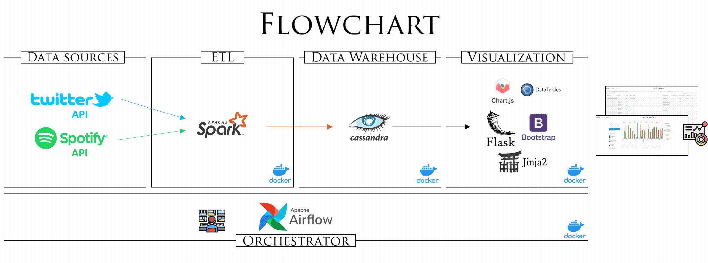

# Extraction, transformation, loading and visualization of combined Twitter and Spotify data in a scalable architecture

This project corresponds in Big Data and uses the social network **Twitter** to obtain information about the latest music listened to by users (by searching the #NowPlaying hashtag) and then query the track and artist data involved that **Spotify**, a music-as-a-service based platform, has. The entire process is managed using widely recognized tools within the field of Big Data.


## Description
This project implements a **ETL process** to collect data from Twitter. The steps of the process are:
 1. The **Twitter API** is consulted to gather the tweets with the hashtag #NowPlaying. The name of the endpoint queried is _recent search_.
 2. The **tweet** is cleaned up, stopwords and other hashtags are removed, and the remaining text (which usually corresponds to the track name and artist) is isolated.
 3. The **Spotify API** is queried with the previously cleaned up text to collect the identified track information. The names of the endpoints queried are _search for item_ and _get tracks' audio features_.
 4. The data is formatted and stored in a **.csv** file.
 5. The data is uploaded to **Cassandra** and the .csv is stored as a history file.
 6. The data served from Cassandra is requested by the **back-end** and served on the **front-end**.
 7. The data is displayed to the **user** on the front-end.




Here is another version of the markdown file, written by a different person:

**Project Overview**

This project is a Docker Compose-based deployment of Apache Airflow, Apache Spark, Apache Cassandra, and a Flask web application.

**Airflow**

Airflow is a workflow orchestration platform that allows you to programmatically author, schedule, and monitor workflows. In this project, Airflow is used to orchestrate the data processing and web application pipelines.

The Airflow containers are configured with the following additional requirements:

* `apache-airflow-providers-apache-spark`
* `requests`
* `pandas`
* `cqlsh`

The base image for the Airflow containers is the official Airflow image (version 2.3.0).

**Spark**

Spark is a unified analytics engine for large-scale data processing. In this project, Spark is used to process the data from Cassandra and generate insights.

The Spark containers are configured with the following additional requirements:

* `requests`
* `pandas`
* `cqlsh`

The base image for the Spark containers is the Bitnami Spark image (version 3.1.2).

**Cassandra**

Cassandra is a distributed NoSQL database that is used to store the data for the web application and Spark processing.

The Cassandra container is configured with no additional requirements. The base image for the Cassandra container is the official Cassandra image (version 4.0).

**Flask**

Flask is a lightweight web framework for Python. In this project, Flask is used to develop a web application that consumes the data processed by Spark.

The Flask container is configured with the following additional requirements:

* `Flask` (version 2.1.2)
* `cassandra-driver` (version 3.25.0)
* `flask-cqlalchemy` (version 2.0.0)
* `redis`
* `Cmake`
* `cryptography`

The base image for the Flask container is the official Python image (version "3.8-slim-buster").


**Data Engineering Project**

This project demonstrates a data engineering pipeline that uses Apache Airflow, Apache Spark, Apache Cassandra, and a Flask web application to extract, transform, and load data from Twitter and Spotify APIs. The pipeline is deployed using Docker Compose.

**Prerequisites**

* Git
* Docker v20.10
* Docker Compose v1.29
* Python v3.8
* Twitter and Spotify APIs developer keys

**Deployment**

1. Clone the project repository:


2. Set the correct permissions on the following folders:

```
sudo chmod -R 777 airflow/logs
sudo chmod -R 777 airflow/plugins
sudo chmod -R 777 spark/resources/history
```

3. Navigate to the project directory:

```
cd Data-Engineer-project/docker
```

4. Build and deploy the project:

```
sudo docker-compose up --build -d
```

5. Access the Airflow UI at http://localhost:8080 (user: "airflow", password: "airflow").

6. Start the "spark_main" DAG.

7. Once the DAG has completed running, the data will be displayed in the web application at http://localhost:8000.

**To stop the project:**

```
sudo docker-compose down
```

**To completely reset the project:**

```
sudo docker-compose down -v
```

**Web Application**

The web application provides three views:

* **Home:** A brief introduction to the project and a GIF illustrating the data flow.
* **Data:** A table with all the extracted data.
* **Visuals:** A chart with two data selectors to add data as bars or lines.

**Troubleshooting**

If you encounter any problems with the project, please consult the following resources:

* The project repository README file
* The Docker Compose documentation
* The Airflow documentation
* The Spark documentation


**Conclusion**

This Docker Compose-based deployment of Apache Airflow, Apache Spark, Apache Cassandra, and a Flask web application provides a simple and effective way to get started with data engineering and machine learning.